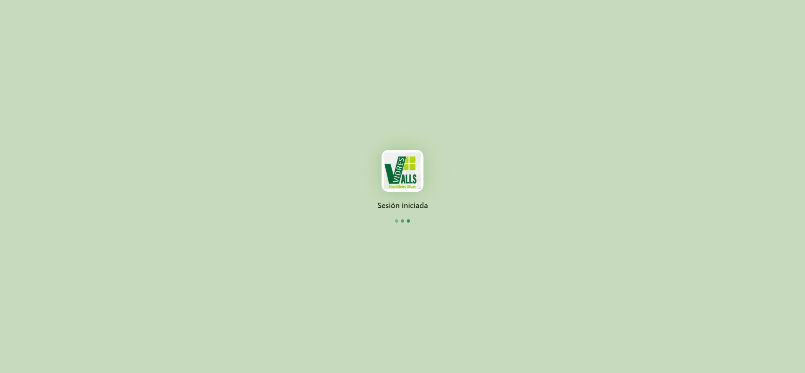

# Guía de Estilo — CristalApp (Vidres Valls · App Interna)

> Sistema visual de la web app interna `https://srv1744329/`. Este documento
> es la referencia para alinear la web pública (`vidres-valls-web`) con la
> identidad de la cristalería que ya usa el equipo en su herramienta de gestión.

> **Nota importante:** la app actual de `vidres-valls-web` (la web pública) usa
> una paleta **azul cyan cristalino** (`#0EA5E9`, `#06B6D4`, …). La app interna
> usa una paleta **verde salvia pastel**. Son sistemas distintos. El objetivo
> de este documento es registrar la segunda para que se pueda decidir si se
> unifican.

---

## 1. Captura de referencia



*(Imagen extraída directamente de `https://srv1744329/` con Playwright,
2026-06-11.)*

---

## 2. Tipografía

| Token              | Valor                                                              |
| ------------------ | ------------------------------------------------------------------ |
| `--font-sans`      | `"Inter", system-ui, sans-serif`                                   |
| `--font-mono`      | `ui-monospace, SFMono-Regular, Menlo, Monaco, Consolas, "Liberation Mono", "Courier New", monospace` |
| Escala `--text-*`  | Tailwind estándar (xs `.75rem` → 5xl `3rem`)                       |

> `Inter` se carga desde Google Fonts en la propia app. En la web pública ya
> está configurado `next/font/google` con Inter + Manrope; **Inter se
> mantiene**, Manrope se puede dejar como `--font-display` o retirar.

---

## 3. Paleta de colores (extraída del CSS compilado de la app)

### 3.1 Verdes (la base)

| Token sugerido       | Hex        | Uso probable                                      |
| -------------------- | ---------- | ------------------------------------------------- |
| `sage-50`            | `#f4f9f0`  | Fondo de inputs, hover sutil                      |
| `sage-100`           | `#ecf3e6`  | Fondo claro, divisor                             |
| `sage-200`           | `#d8edd4`  | Hover, divisor activo                            |
| `sage-300`           | `#c8e0c4`  | Borde activo suave                               |
| `sage-400`           | `#a8d8a0`  | Estado "ok" tenue / chips                        |
| `sage-500`           | `#7a9a72`  | Texto secundario sobre fondo claro               |
| `sage-600`           | `#7a8a72`  | Texto muted                                       |
| `sage-700`           | `#4a6a20`  | Texto principal sobre claro                      |
| `sage-800`           | `#1a5a30`  | Hover oscuro sobre CTA                           |
| `sage-900`           | `#0c1e14`  | Texto máximo contraste                           |

### 3.2 Verde "marca" (más vivo)

| Token sugerido       | Hex        | Uso probable                                      |
| -------------------- | ---------- | ------------------------------------------------- |
| `brand-50`           | `#e8f4e3`  | Fondo de badges éxito                            |
| `brand-100`          | `#d6e4ce`  | Fondo hover primario                             |
| `brand-300`          | `#a8d830`  | Acento vivo (botón "Activo", enlace destacado)   |
| `brand-500`          | `#1a7a3a`  | **Primary** — usado en `<meta name="theme-color">` light |
| `brand-600`          | `#156530`  | Primary hover                                    |
| `brand-700`          | `#1a6a30`  | Primary active                                   |

> El theme-color del HTML es `#1a7a3a` en light y `#0a1a10` en dark — esa es la
> pista oficial de qué color considera la app como "su color".

### 3.3 Neutros / fondos

| Token sugerido       | Hex        | Uso                                              |
| -------------------- | ---------- | ------------------------------------------------ |
| `neutral-0`          | `#ffffff`  | Card, inputs                                     |
| `neutral-50`         | `#f4f9f0`  | Fondo general (login)                            |
| `neutral-100`        | `#ecf3e6`  | Fondo hover, divisor                             |
| `neutral-200`        | `#c8dabe`  | Borde input                                     |
| `neutral-700`        | `#1c2c10`  | Texto principal                                  |
| `neutral-800`        | `#15241b`  | Texto fuerte (botones)                           |
| `neutral-900`        | `#0a1a10`  | Fondo dark mode, theme-color dark                |

### 3.4 Estados (semáforo)

| Estado    | Fondo     | Texto/Borde | Hex texto   |
| --------- | --------- | ----------- | ----------- |
| Success   | `#e8f4e3` | `#1a7a3a`   | (verde marca) |
| Warning   | `#fef3e2` | `#d97706`   | naranja ambar |
| Error     | `#fce8e6` | `#c0392b`   | rojo         |
| Info      | `#e0f0d8` | `#4a6a20`   | verde oliva  |

---

## 4. Radios (border-radius)

Tailwind estándar con un matiz: el "sm" es más pequeño de lo habitual.

| Token         | Valor      | Uso                                          |
| ------------- | ---------- | -------------------------------------------- |
| `radius-sm`   | `.25rem` (4px)  | Checks, separadores                     |
| `radius-md`   | `.375rem` (6px) | Botones secundarios, inputs            |
| `radius-lg`   | `.5rem` (8px)   | Botones primarios, tarjetas pequeñas    |
| `radius-xl`   | `.75rem` (12px) | Tarjetas medianas, contenedores        |
| `radius-2xl`  | `1rem` (16px)   | **Card principal del login** ← lo más representativo |
| `radius-full` | `9999px`        | Avatares, chips circulares              |

---

## 5. Sombras (box-shadow)

La sombra **protagonista** es la de la card del login — muy difusa, casi imperceptible:

```css
/* Sutil elevación de card */
box-shadow: 0 1px 3px #0f172a0a, 0 1px 2px #0f172a0f;

/* Card elevada */
box-shadow: 0 4px 12px #0f172a14, 0 2px 4px #0f172a0a;

/* Card destacada */
box-shadow: 0 8px 24px #0f172a14;
```

> La paleta de sombras usa tonos **`#0f172a`** (slate-900) con opacidad muy
> baja (4–8%) — no usa negro puro.

Hay además una sombra de acento ámbar (probable de focus/badges especiales):

```css
box-shadow: 0 4px 14px #f59e0b59;   /* ámbar 35% */
box-shadow: 0 6px 20px #f59e0b80;   /* ámbar 50% */
```

---

## 6. Background y atmósfera

El fondo del login es **verde salvia muy claro** (`#d0e0cc` aprox.) con:

- **Textura noise/grain finísima** (malla de papel pintado)
- **Polígonos irregulares** (pentágonos/hexágonos asimétricos) en un verde
  ligeramente más cálido (`#dde3c4`), sin borde, baja opacidad, repartidos
  por las esquinas.

Layout general:

- Card centrada con flexbox
- Botones de idioma y tema (luna/sol) en la **esquina superior derecha**
- Slogan centrado en el **footer**

---

## 7. Componentes UI representativos

### 7.1 Botón primario

- Fondo verde salvia medio (`#7ea987` aprox.)
- Texto blanco
- Radio `radius-lg` (8px)
- Full-width dentro de la card
- Sombra muy ligera
- Icono de flecha `→` a la derecha del label

### 7.2 Input

- Borde 1px `neutral-200` (`#c8dabe`)
- Fondo casi blanco (`#fafafa`)
- Radio `radius-md` (6px)
- Padding generoso
- Iconos de acción (ojo, lupa) outline a la derecha

### 7.3 Botón secundario (ghost)

- Fondo del color de la card (transparente sobre el contenedor)
- Borde 1px `neutral-200`
- Icono lineal (no relleno) a la izquierda
- Distribución 2 columnas para alternativas de login (Passkey / QR)

### 7.4 Separador con texto

```
───  o continúa con  ───
```

Línea 1px, color `neutral-200`, texto xs uppercase en muted.

---

## 8. Variables CSS sugeridas (Tailwind 4 `@theme`)

Para integrarlo en `src/app/globals.css`:

```css
@theme inline {
  /* Verde salvia — CristalApp */
  --color-sage-50:  #f4f9f0;
  --color-sage-100: #ecf3e6;
  --color-sage-200: #d8edd4;
  --color-sage-300: #c8e0c4;
  --color-sage-400: #a8d8a0;
  --color-sage-500: #7a9a72;
  --color-sage-600: #7a8a72;
  --color-sage-700: #4a6a20;
  --color-sage-800: #1a5a30;
  --color-sage-900: #0c1e14;

  /* Verde marca */
  --color-brand-50:  #e8f4e3;
  --color-brand-100: #d6e4ce;
  --color-brand-300: #a8d830;
  --color-brand-500: #1a7a3a;
  --color-brand-600: #156530;
  --color-brand-700: #1a6a30;

  /* Estados */
  --color-warning:    #d97706;
  --color-warning-bg: #fef3e2;
  --color-error:      #c0392b;
  --color-error-bg:   #fce8e6;

  /* Radios */
  --radius-sm:  .25rem;
  --radius-md:  .375rem;
  --radius-lg:  .5rem;
  --radius-xl:  .75rem;
  --radius-2xl: 1rem;
}
```

---

## 9. Decisión pendiente (para el usuario)

**¿Unificamos la web pública con la paleta verde de CristalApp, o mantenemos
la azul cyan cristalino actual?**

| Opción                                            | Pros                                            | Contras                                          |
| ------------------------------------------------- | ----------------------------------------------- | ------------------------------------------------ |
| A. **Migrar a verde salvia**                      | Coherencia total con la herramienta interna    | Hay que rehacer gradientes y "glass" azul         |
| B. **Mantener azul + alinear tokens/densidad**    | No rompe la web pública ya hecha               | La identidad pública e interna no encajan         |
| C. **Híbrido**: azul para marketing, verde para sección "App / gestión" | Diferencia el público del profesional | Puede confundir a los clientes |

Dime cuál prefieres y arranco.
